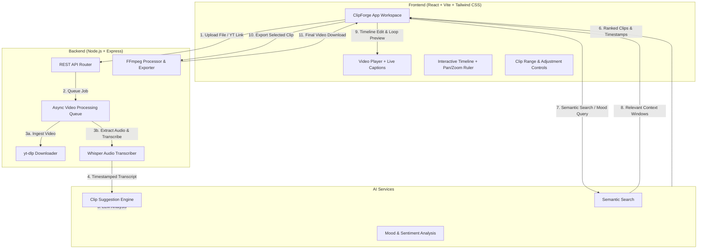

# VidHntr 

AI-assisted video repurposing platform: automated clip discovery, natural-language semantic search over video transcripts, timestamped transcription, and an interactive timeline editor for turning long-form video into short-form clips.

[](LICENSE)
[](https://nodejs.org)
[](https://ffmpeg.org)

---

## Overview

Repurposing long-form video into short-form clips (for platforms such as TikTok, YouTube Shorts, and Instagram Reels) typically requires manually reviewing entire recordings to identify and trim clip-worthy moments. This is slow and does not scale with content volume.

ClipForge automates this workflow end to end:

1. Ingests local video files or YouTube URLs.
2. Transcribes audio with timestamp alignment (Whisper).
3. Analyzes the transcript with an LLM to surface candidate clips, scored on hook strength, payoff, and self-containment.
4. Supports semantic search over the transcript, letting users search for a specific word, phrase, or line they recall from the video and get matching moments with precise timestamps.
5. Provides a timeline and video player editor with synced playback, clip looping, live captions, and fine-grained timestamp adjustment.
6. Exports trimmed clips ready for distribution.

## Status

Core ingestion, transcription, clip suggestion, semantic search, and the timeline editor are implemented and functional end to end. Items under active development are tracked in the Roadmap section below.

---

## Key Features

### AI Clip Discovery
- Scans the full transcript and evaluates candidate segments on a normalized quality scale, using heuristics similar to those a human editor would apply:
  - Hook strength in the opening seconds.
  - Whether the segment delivers a clear payoff (insight, punchline, or reveal).
  - Whether the clip is understandable without the surrounding video for context.
- Expands raw matches into clip windows in the 15–45 second range.

### Semantic Search
- Search a video for a specific word, phrase, or line the user remembers, and get matching moments with precise timestamps.
- Returns ranked results with relevance scores and short explanations for each match.

### Mood and Category Filters
- Quick filters for common categories: funny, dramatic, emotional, exciting, sad, angry.

### Video Player
- Standard playback controls with auto-hide overlay during playback.
- Click-to-toggle play/pause on the video frame.
- Synchronized live captions rendered from the transcript.

### Timeline Editor
- Pan and zoom controls, usable across clip lengths from short clips to multi-hour recordings.
- Draggable range handles for setting clip start/end points.
- Playhead tracking synced to playback and seeking.
- Clip looping constrained to the selected range for quick preview.
- Fine adjustment controls (±0.1s, ±1s) and direct timestamp entry (HH:MM:SS.s).

### Ingestion and Export
- Accepts local uploads (.mp4, .webm, .mov, .mkv, .avi) or YouTube URLs via yt-dlp.
- Background job queue with progress reporting.
- FFmpeg-based clip export.

---

## Architecture



---

## Tech Stack

### Frontend
- React, Vite
- Tailwind CSS
- HTML5 Video API, custom pointer-capture handling for timeline interactions

### Backend and AI Pipeline
- Node.js (ES Modules), Express.js
- LLM API for clip scoring and semantic search (see `.env` configuration)
- Whisper for timestamped speech-to-text
- FFmpeg (`fluent-ffmpeg`) and `yt-dlp` for video ingestion and export
- Multer, CORS, dotenv, UUID

Note: verify the exact model name and version you are using against your provider's current documentation before publishing — model names and versions change frequently and should not be hardcoded into project documentation without confirming they're current and correctly spelled.

---

## Getting Started

### Prerequisites
- Node.js v18.x or higher
- npm v9.x or higher
- FFmpeg, installed and available on your system `PATH`
- yt-dlp (optional, required only for YouTube URL ingestion)

### 1. Clone the repository
```bash
git clone https://github.com/Johnny-J-01/ClipForge.git
cd ClipForge
```

### 2. Configure the backend environment
```bash
cd backend
```

Create a `.env` file:
```env
PORT=4000
CLIENT_ORIGIN=http://localhost:5173

# AI & Transcription Keys
GEMINI_API_KEY=your_api_key_here
OPENAI_API_KEY=your_openai_api_key_here   # Optional, for cloud Whisper
GROQ_API_KEY=your_groq_api_key_here       # Optional, alternative fast Whisper

# Path to yt-dlp binary (if not on PATH)
YTDLP_PATH=yt-dlp
```

### 3. Install dependencies and start services

Backend:
```bash
cd backend
npm install
npm start
```
Runs on `http://localhost:4000`.

Frontend (new terminal):
```bash
cd frontend
npm install
npm run dev
```
Runs on `http://localhost:5173`.

---

## API Reference

| Endpoint | Method | Description |
|---|---|---|
| `/api/health` | GET | Health check endpoint |
| `/api/videos/upload` | POST | Upload a local video file (multipart/form-data) |
| `/api/videos/youtube` | POST | Ingest a video via YouTube URL |
| `/api/videos/:id` | GET | Retrieve video metadata, status, and progress |
| `/api/videos/:id/transcript` | GET | Fetch the timestamped transcript |
| `/api/videos/:id/suggestions` | GET | Get AI-generated clip recommendations |
| `/api/videos/:id/search` | POST | Run a semantic natural-language search over the video |
| `/api/exports` | POST | Render and export a selected clip range |

---

## Repository Structure

```
ClipForge/
├── backend/
│   ├── routes/
│   │   ├── videos.js         # Upload, status, transcript & search endpoints
│   │   └── exports.js        # FFmpeg clipping export routes
│   ├── services/
│   │   ├── ai.js             # Clip scoring & semantic search
│   │   ├── transcription.js  # Whisper STT & transcript chunk indexing
│   │   ├── ffmpeg.js         # Audio extraction & video rendering
│   │   ├── jobs.js           # Async background video processing queue
│   │   ├── ytdlp.js          # YouTube downloader integration
│   │   └── store.js          # Persistent JSON storage manager
│   ├── app.js                # Express app entry point
│   └── package.json
│
├── frontend/
│   ├── src/
│   │   ├── components/
│   │   │   ├── editor/       # VideoPlayer, Timeline ruler, ClipControls
│   │   │   ├── search/       # SuggestionsPanel, ResultsPanel, MoodChips
│   │   │   ├── sources/      # SourcesPanel, UploadCard, YouTubeInput
│   │   │   └── export/       # ExportModal, ExportButton
│   │   ├── pages/
│   │   │   └── ClipForge.jsx # Main creator workspace page
│   │   ├── index.css         # Design tokens & Tailwind utilities
│   │   └── main.jsx
│   ├── package.json
│   └── vite.config.js
│
└── README.md
```

---

## License

Distributed under the MIT License. See `LICENSE` for details.
